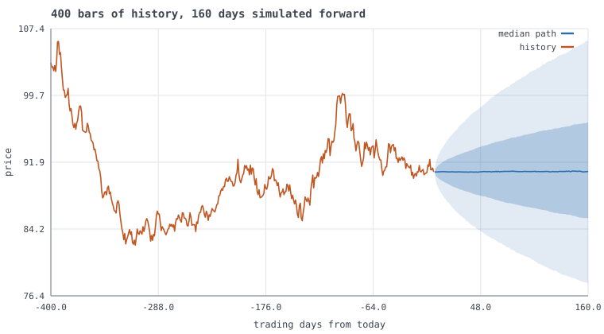
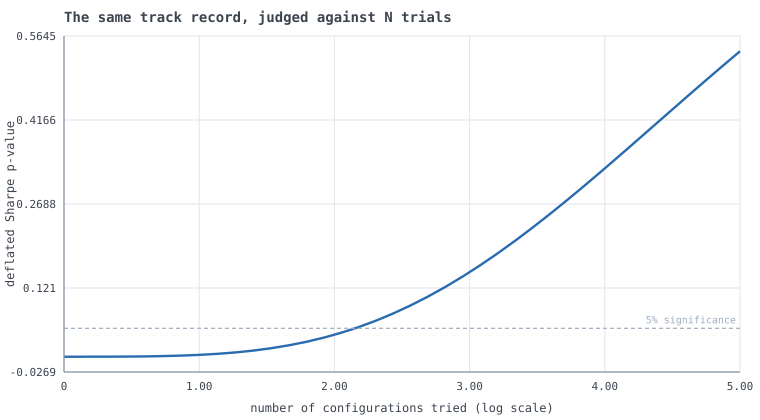
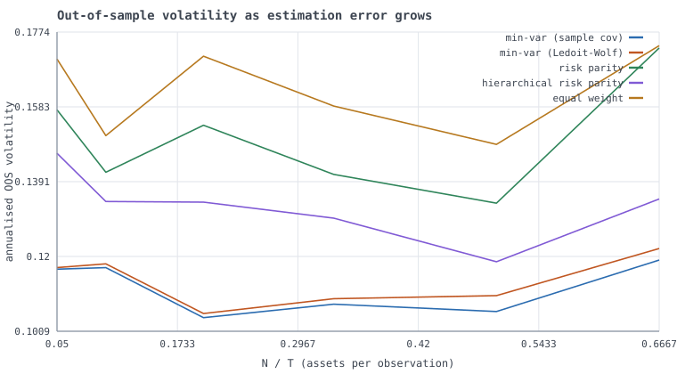
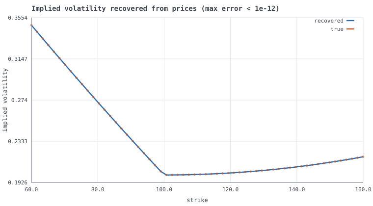
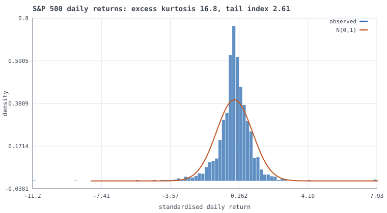
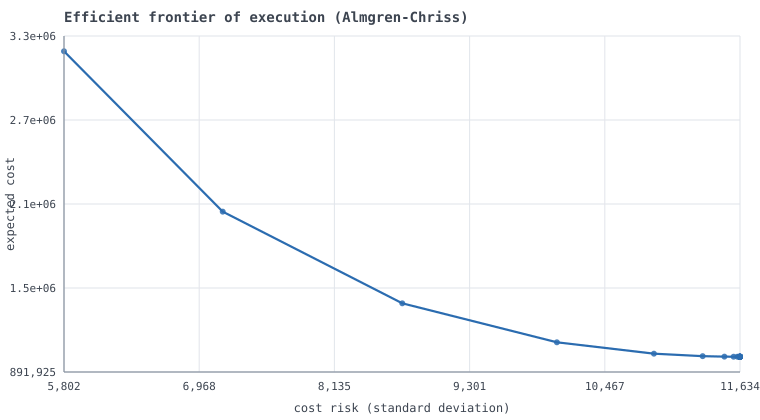
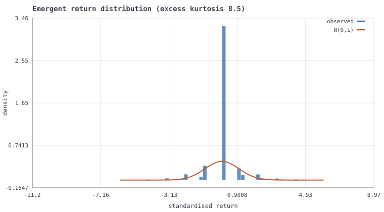

# QuantOS

[](https://github.com/danielboulan10/QuantOS/actions/workflows/ci.yml)
[](https://danielboulan10.github.io/QuantOS/)
[](forward/RECORD.md)
[](tests/)
[](docs/TEST_QUALITY.md)
[](docs/ddr/DDR-002-numpy-only-runtime.md)
[](pyproject.toml)
[](LICENSE)
[](https://github.com/danielboulan10/QuantOS/actions/workflows/ci.yml)
[](scripts/verify_claims.py)

### → **[Try it: danielboulan10.github.io/QuantOS](https://danielboulan10.github.io/QuantOS/)**

**Type a ticker. Get a full quantitative research report.**



*400 bars of history, then 20,000 simulated forward paths shown as quantile bands.
The forecast is the spread, not a line — and the median sits flat because expected
return cannot be estimated over this horizon to any useful precision. Saying so is
the point.*

```bash
quantos serve                      # a search bar in your browser
quantos research --ticker NVDA     # or straight from the terminal
```

No API key, no data file, no account. Any listed symbol — US equities, ETFs,
indices, foreign listings, crypto — resolves to ten years of split- and
dividend-adjusted history and runs through the whole pipeline: return
distribution and tail behaviour, risk and drawdown, GARCH volatility dynamics,
regime detection, factor exposures with HAC standard errors, a pre-registered
signal battery corrected for multiple testing, an option strike ladder with full
Greeks, and square-root execution costs.

**One runtime dependency: NumPy.** Every special function, distribution,
statistical test, optimiser, root finder, chart and data feed is implemented in
this repository and validated against SciPy — which appears *only* as a
test-time oracle, enforced by a CI job that installs without it. The reasoning is
in [DDR-002](docs/ddr/DDR-002-numpy-only-runtime.md).

```bash
pip install -e ".[test]"

quantos serve                             # search bar at localhost:8000
quantos research --ticker AAPL            # any listed symbol, no key required
quantos research --ticker ^GSPC           # indices, crypto (BTC-USD), LSE (VOD.L)
quantos research --csv my_prices.csv      # or your own file
quantos research --series spx             # or anything on FRED
quantos forward   --ticker SPY            # record predictions, scored later
quantos surface   --chain chain.csv       # SVI vol surface, variance risk premium
quantos intraday  --csv ticks.csv         # noise-corrected realised volatility
quantos demo                              # tour every subsystem, ~2 minutes
pytest                                    # 627 tests, incl. every docstring example
```

## The search bar

`quantos serve` starts a local viewer: type a symbol, get the report with charts.
It is stdlib `http.server` and hand-written HTML — no Flask, no JavaScript
charting library, and the SVG comes from this repository's own renderer, because
DDR-002 fixes the runtime dependencies at NumPy alone and a web view is not a
good enough reason to break that. It binds to localhost and has no
authentication: a local viewer for a research tool, not a deployable service.

The page leads with what the analysis can and cannot do. **Volatility is
genuinely forecastable** — it clusters, and the GARCH persistence and half-life
measured on the instrument's own history are that predictability quantified — so
the viewer gives a volatility forecast and the price range it implies.
**Direction is not**, on this evidence, and the page says so rather than
manufacturing a target: the signal battery below it shows nine standard
predictors judged only after correcting for the fact that nine were tried.

## `quantos research` — one ticker in, a full report out

It runs every analysis that *applies to that asset class*, skips the ones that do
not, and says why — an option does not get a Sharpe ratio, because its return
distribution is dominated by payoff convexity rather than by any edge. The asset
class comes from the exchange, not from a flag you have to remember to set.

```console
$ quantos research --ticker NVDA

resolved NVDA (NVIDIA Corporation) [equity on NasdaqGS in USD]
  2514 daily bars, 2016-07-25..2026-07-24, adjusted close

RETURN DISTRIBUTION      annualised vol 49.61%, skew 0.076, excess kurtosis 6.46
                         Hill tail index 3.18  ->  fat-tailed; Gaussian VaR understates
RISK                     Sharpe 1.015  (standard error 0.317  ->  distinguishable from zero)
                         max drawdown -66.34%, 373 days underwater
                         VaR/CVaR 99%: 7.97% / 10.79%   ->  CVaR/VaR = 1.35
VOLATILITY               Engle ARCH-LM p = 2.9e-14  ->  clustering is real, fit GARCH
                         GARCH(1,1) persistence 0.9161, shock half-life 7.9 days
                         leverage gamma  ->  down moves raise vol more than up
REGIMES                  volatility regimes identified without look-ahead
FACTORS                  market beta 2.31 (t 12.5), HAC standard errors, 53% idiosyncratic
SIGNALS                  9 pre-registered signals, all corrected for multiple testing
OPTIONS                  30-day strike ladder with all Greeks at realised vol
EXECUTION                square-root impact cost by participation rate
```

Prices are **total-return adjusted**, and that is not a detail. Measured across
ten years of history, using unadjusted closes changes the answer:

| | raw CAGR | adjusted CAGR |
|---|---:|---:|
| Verizon (VZ) | **(1.85)%** | **3.59%** |
| Exxon (XOM) | 5.48% | 10.17% |
| Coca-Cola (KO) | 6.10% | 9.47% |
| Berkshire (BRK-B) | 13.16% | 13.16% |

On raw prices Verizon *lost* money over a decade; on a total-return basis it made
money. The sign of the conclusion flips. Berkshire, which pays no dividend, shows
a gap of exactly zero — which is the control that confirms the mechanism rather
than a coincidence. Nothing about this raises an error, which is what makes it
worth being deliberate about. See [`data/market.py`](src/quantos/data/market.py).

### The signal battery is the point

Any tool can compute a momentum score. The hard part is knowing which signal
survives the fact that you computed nine of them. So every signal is reported
with its **deflated Sharpe ratio**, a purged out-of-sample Sharpe, and whether it
survives a **Hansen SPA test** run over the battery jointly:

```
  signal                  IS Sharpe  deflated p  OOS Sharpe  turnover  verdict
  vol_scaled_momentum         0.434       0.568       0.188       0.5  no evidence
  momentum_252d               0.306       0.712       0.422       4.5  no evidence
  mean_reversion_21d          0.234       0.781       0.335      37.5  no evidence
  ...
  Hansen SPA over the battery   p = 0.3800
  -> nothing survives correction for multiple testing.
```

**On a liquid instrument, nothing will survive. That is the correct answer.** The
battery is calibrated: given AR(0.35) momentum it finds a 2.27 Sharpe at p<0.0001,
and given a random walk it finds nothing. A detector that never fires is useless;
one that always fires is worse.

The battery is **pre-registered** — its size is fixed in source before any data is
seen, which is the condition under which the deflation correction is valid. A tool
that let you keep adding signals until one looked good would invalidate its own
statistics.

### What it refuses to do

- **No Sharpe ratio on a yield.** A rate is not held, so it has no return.
- **No GARCH without ARCH effects.** Engle's LM test runs first. On i.i.d. data an
  unguarded fit reports persistence 1.0000 and a 442,909-day half-life — finite,
  precise-looking, meaningless.
- **No self-regression.** A factor correlated >0.999 with the instrument is
  dropped rather than reported as beta 1.0 with a t-statistic of 1e21.
- **No number without its qualifier.** Every Sharpe carries its standard error;
  every signal its deflated p-value.

---

## See it first

Twelve figures, all generated by `python scripts/build_gallery.py` from real
computations — **[full gallery with commentary →](docs/GALLERY.md)**

| | |
|:--:|:--:|
|  |  |
| **The same track record, judged against N trials.** The evidence never changes; what it is worth collapses as the search widens. | **Portfolio methods as estimation error grows.** Minimum-variance degrades sharply as N/T rises; HRP never inverts the covariance. |
|  |  |
| **Implied volatility inverted from prices** to twelve decimals, including deep-OTM strikes where vega is ~1e-9. | **Real S&P 500 returns against the Gaussian** a parametric risk model assumes. The gap is why CVaR exists. |
|  |  |
| **There is no optimal execution, only a frontier.** The bottom-right end is TWAP — not a naive baseline but the exact risk-neutral optimum. | **Emergent fat tails** from the simulated market. No agent was told to produce them. |

Every chart is SVG written by [`quantos/viz/svg.py`](src/quantos/viz/svg.py), 500
lines with no matplotlib, because a plotting dependency would have broken the
NumPy-only rule.

---

## Real data, no API key

FRED carries far more than macro aggregates — equity indices, the VIX, the whole
Treasury curve, credit spreads, FX and commodities — as plain keyless CSV. So
`quantos.data` reaches it with nothing but `urllib` from the standard library.

```console
$ quantos analyse --bundle equity --start 2018-01-01

S&P 500  [SP500]
  2,151 observations, 2018-01-02 to 2026-07-24, latest 7,412

  annualised return          12.59%
  annualised volatility      19.32%
  Sharpe ratio                0.614
    autocorr-adjusted         0.921
  maximum drawdown          -33.92%
  VaR 95% / CVaR 95%          1.79% / 2.98%
  VaR 99% / CVaR 99%          3.44% / 5.16%
  skew / excess kurtosis      -0.65 / 14.82
  Hill tail index              2.57   (empirical equities ~3)

  GARCH(1,1)             alpha 0.167  beta 0.799  persistence 0.9657
    shock half-life            19.8 days
    1-step vol forecast      14.09% annualised

  stationarity           unit root / integrated (both tests agree)
```

Twenty-one series are catalogued by plain name (`quantos analyse --list`) and
grouped into six bundles — `equity`, `rates`, `risk-appetite`, `inflation`,
`macro`, `crossasset`. Any raw FRED id works too.

**Individual stocks and ETFs** are not on FRED, so pass a CSV instead —
`quantos analyse --csv SPY.csv`. Yahoo Finance's Download button works as-is. The
loader prefers the *adjusted* close and warns when it cannot find one, because
using the raw close on a dividend payer injects a fake negative return on every
ex-dividend date and quietly biases every statistic downstream.

The catalogue records whether each series is a **level** or a **rate**, and that
is load-bearing: log returns are meaningful for an index and meaningless for a
yield, which can be zero or negative. Confusing the two is how you end up
reporting "VIX annualised volatility: 128%".

---

## What this is, concretely

Five things that most quant repositories do not do, each linked to the code:

**1. The market simulation is measured across seeds, and reports a negative result.**
[`quantos/sim`](src/quantos/sim) runs noise traders, informed traders,
Avellaneda-Stoikov market makers, momentum and mean-reversion traders against a
real matching engine with per-agent latency. A latent fundamental value
([`fundamental.py`](src/quantos/sim/fundamental.py)) is visible to informed
traders and to nobody else.

Does the market discover it? Over 16 seeds
([`scripts/measure_price_discovery.py`](scripts/measure_price_discovery.py)) the
correlation between the mid and that latent value averages **0.29 with a standard
deviation of 0.48**, ranging from −0.69 to +0.88. So: better than chance, but
**this model does not reliably discover its own fundamental**, and any single run
is nearly uninformative. An earlier draft of this README quoted 0.78 — which was
the best of the three seeds that had been run at the time. Catching that is the
single most useful thing the measurement script did.

What *does* survive averaging is an ablation. Giving the market makers
Glosten-Milgrom inference — revise fair value up when repeatedly lifted on the
ask — triples the mean correlation, 0.09 → 0.29, and lifts the share of runs
above 0.5 from 7% to 40%. It also costs something: fair-value dispersion widens
the mean spread from 2.79 to 4.69 ticks and introduces −0.17 lag-1 return
autocorrelation. Both columns are tabulated in
[`scenarios.py`](src/quantos/sim/scenarios.py); neither dominates.

Why discovery is weak is a modelling fact worth stating: informed traders' *net*
flow is bounded by their position limits, while sign-balanced noise flow
accumulates a random walk of comparable size over the same horizon. A continuous
double auction of heuristic agents has no equilibrium mechanism forcing price to
value. Getting one requires a Kyle-style batch auction with a maker solving an
explicit filtering problem — a different model, not a tuning change.

**2. Stylised facts are measured, not asserted — and several fail.**
[`stylized_facts.py`](src/quantos/sim/stylized_facts.py) tests the simulated tape
against Cont's list. Reliably reproduced on every seed: excess kurtosis (6.8),
volatility clustering (mean ACF of |r| = 0.28) and long-memory volatility (Hurst
0.90) — none of which is present in the latent process, whose increments are
i.i.d. by construction and asserted to be so. Not reproduced: the empirical
power-law tail index (~18 against ~3), the leverage effect, and — once maker
learning is enabled — uncorrelated returns. Each failure is named in
[`scenarios.py`](src/quantos/sim/scenarios.py) along with the missing mechanism.
A simulator claiming seven of seven deserves more suspicion than one that says
which it misses and why.

**3. Microstructure estimators are validated against known answers.**
Because the simulator knows the true aggressor side of every trade and the true
size of every parent order, [`microstructure.py`](src/quantos/research/features/microstructure.py)
can score the estimators rather than merely apply them. Kyle's lambda recovers
0.002003 from a true 0.002; Roll's implied spread recovers 0.0996 from a true
0.10; Lee-Ready trade-sign inference can be given an *error rate* instead of an
assumption. That inversion — estimator as object of study — is the main reason to
build a simulator rather than download a dataset.

**4. Backtest overfitting is treated as the default hypothesis.**
[`validation.py`](src/quantos/strategy/validation.py) implements the deflated
Sharpe ratio, the probability of backtest overfitting via CSCV, purged K-fold
with an embargo, and combinatorial purged CV. `quantos validate` plants exactly
one genuinely profitable strategy among 500 and shows what each method concludes.

With a modest 6bp/day edge the search finds **pure noise** — a configuration with
a 1.51 annualised Sharpe and no edge whatsoever, which beat the real one in
sample. The naive p-value calls it significant at 0.0003. Deflation, PBO, White's
Reality Check, Hansen's SPA and StepM all decline. Raise the edge
(`--edge 0.0025`) and every method identifies the right configuration by index.
Seeing both regimes is the point: the tools are not a formality that a good
strategy passes, they are the difference between the two outcomes.

**5. Numerical edge cases are handled, and the handling is the interesting part.**
`implied_volatility` refuses to return a number when an option's time value falls
below float64 resolution next to its intrinsic value, because there is no
identifiable volatility to return — an unguarded solver happily reports `0.0` for
a case whose true volatility is 15%. `erfc`'s branch points are chosen by
*cancellation* analysis rather than convergence rate. `risk_parity` uses a damped
iteration because the textbook fixed point oscillates.

---

## Results this repository publishes against itself

The unusual thing here is not the volume of code. It is that the measurements
were kept when they came out badly:

| Finding | Where |
|---|---|
| The market simulation does **not** reliably discover its own fundamental — mean correlation 0.29, sd 0.48 | [README below](#what-this-is-concretely) |
| A NumPy attention model **loses** to GARCH, and CI fails if it ever starts winning | [leaderboard](docs/MODEL_LEADERBOARD.md) |
| Forecast probabilities have real skill for ordinary moves and **none** for rare ones | [calibration](src/quantos/forecast/calibration.py) |
| **No** standard VaR model passes on SPY; the best delivers 1.55% against a promised 1% | [VaR backtest](docs/VAR_BACKTEST.md) |
| Mutation testing found a module scoring **0%** — no test file existed | [test quality](docs/TEST_QUALITY.md) |
| Almgren-Chriss **misranks** execution schedules when permanent impact is schedule-dependent | [execution backtest](src/quantos/execution/backtest.py) |
| Heston's own 1993 formulation overprices by **93%** at T=5, silently | [Heston](src/quantos/derivatives/heston.py) |

## Every number in this README is checked by CI

Documentation rots silently: a refactor moves a constant, the prose keeps quoting
the old figure, and nothing fails. So the prose is not trusted —
[`scripts/verify_claims.py`](scripts/verify_claims.py) **re-derives fifteen
documented claims from scratch on every build** and fails if any has drifted.

```console
$ python scripts/verify_claims.py
  ok  special functions match SciPy to the documented tolerance
      all within 1e-09 (erf 6.66e-16, ndtri 3.33e-15, lgamma 8.53e-14)
  ok  the Brier decomposition closes to machine precision
      closes to 2.8e-17; dropping the residual would leave 4.2e-04
  ok  overlapping predictions are discounted ~42x
      1305 predictions -> 29 independent, factor 45.0x
  ok  the calibration verdict refuses to pass a no-skill model
  ok  touching a level is never less likely than finishing beyond it
  ok  price discovery is weak: mean correlation ~0.29 across seeds
  ok  the C++ book is ~30x the pure Python one, batched
      median 17,970,515 ops/s over 5 runs (range 16.4M-18.3M)
  ok  the neural model loses to GARCH on QLIKE
      GARCH 1.2659 < EWMA 1.3022 < attention 1.4443, as documented
  ok  the Heston branch cut still bites the original formulation
      original overprices by 2.14x at T=5 (54.58 vs 25.51)
  ok  American pricing matches the Longstaff-Schwartz benchmark
      4.4734 +/- 0.0147 against the published 4.478
  ok  no standard VaR model passes on SPY
      Gaussian VaR breaches 2.44% against a promised 1.00%, rejected
  ok  the runtime imports nothing but NumPy
  ok  every documented gallery figure exists
  ok  the disclaimer appears on every rendered page

15 verified, 0 skipped, 0 failed
```

Note what the eighth line does: it re-derives the result showing this
repository's own neural model **losing**, and fails the build if the model ever
starts winning — because then the leaderboard would be stale and the honest thing
is to rewrite it. Checking the claims you would rather were true is the only
version of this that means anything.

Writing the checker found a bug in the checker. Its first version grepped source
lines for imports and reported `core/linalg.py` as importing a package called
"finance" — from the sentence *"...from finance", IMA J. Numer. Anal.* in a
citation. Three of its four findings were prose. It parses the AST now.

---

## Four things added most recently

Each of these exists because the previous version of this README admitted it was
missing, and each one is validated against a case where the answer is known.

### A C++ order book — and the measurement that made it worth building

The obvious way to use a compiled order book is to call it once per operation.
That was built first and benchmarked at **1.2x** the pure Python book, which is
not worth a build step. Profiling showed why: **83% of the runtime was Python
object churn**, not matching. The C++ core was never the bottleneck.

Batching the tape across the boundary removes it:

| Path | ops/s (median) | speedup |
|---|---:|---:|
| Pure Python, `Order` dataclass | ~435,000 | 1.0x |
| C++ through the per-call wrapper | ~660,000 | 1.5x |
| C++ raw, no dataclass, no wrapper | ~3,800,000 | 8.7x |
| **C++ batched** ([`replay.py`](src/quantos/exchange/replay.py)) | **~15,100,000** | **~35x** |

Medians of repeated runs, rounded — the batched figure ranged from 8.1M to 16.5M
across seven runs of the same two-million-operation tape on an unquiet laptop.
An earlier draft of this table quoted `16,012,260`, which was a single run near
the top of that range, reported to six significant figures it had not earned.
Wall-clock throughput is not a precise quantity and should not be written as one.

The compiled backend is optional and never committed as a binary.
[`tests/exchange/test_cpp_equivalence.py`](tests/exchange/test_cpp_equivalence.py)
replays identical order flow through both implementations — a Hypothesis-driven
comparison plus a 20,000-operation deterministic replay — and requires every
resting order to match. Matching is exact integer arithmetic, so "close enough"
is not a category that exists here.

### Forward testing, which is the only backtest that cannot be overfit

**It is live.** [`forward/RECORD.md`](forward/RECORD.md) is regenerated by a
scheduled job that runs after every US close, records forecasts for nine
pre-registered signals across eight instruments, settles the ones whose horizon
has elapsed, and commits the result. The ledger's hash chain shows nothing was
edited in place; the commit history timestamps when each prediction arrived. Those
two together are the whole claim — that these forecasts existed before their
outcomes did.

Two corrections are built into the scoreboard, because without them a forward
record flatters itself just as efficiently as a backtest:

- **Overlapping predictions are discounted.** A 30-day forecast recorded
  repeatedly shares most of its days with itself. Simulated over three years of
  real prices, 1,305 settled predictions carried the information of **31
  independent** observations — a 42x overlap factor. The hit rate uses every
  prediction; the confidence interval uses the independent subset, so a 61% hit
  rate reads as `[43%, 76%]` rather than as overwhelming evidence.
- **Signals that are not really distinct are detected and merged.** Only the
  *sign* of a position is recorded, so `vol_scaled_momentum` turned out to be
  identical to `momentum_252d` on 100% of days — volatility scaling changes bet
  size, and size is not what a direction-only record scores. The multiple-comparison
  correction uses 8 distinct signals, not 9, and the scoreboard says so.


Everything else in this repository that validates a strategy is a *correction*:
deflated Sharpe, PBO, purged cross-validation, Hansen's SPA. They all exist
because the researcher saw the data before choosing the strategy.

[`quantos/live`](src/quantos/live) needs none of them. A prediction written down
today, for a horizon that has not happened yet, cannot be tuned to its own
outcome. The ledger is append-only JSONL with a SHA-256 hash chain: recording an
outcome *appends* a settlement rather than editing the forecast, there is no
update path in the API, and editing any earlier line breaks every subsequent
hash. Re-running the same day is refused, because prediction ids are derived from
the content of the decision rather than a counter.

```bash
quantos forward --csv prices.csv --symbol SPY     # settle what is due, record today
quantos forward --score-only                      # read the record back
```

The scoring reports a Wilson interval, not a bare hit rate, because three correct
calls out of three is not evidence of skill and the interval says so.

### Option chains, and what the options market charges for risk

[`data/options.py`](src/quantos/data/options.py) is mostly filtering, and the
filtering is the substance: in-the-money options are dropped (their prices are
dominated by intrinsic value, so implied volatility is badly conditioned there),
zero-bid contracts are dropped (a midpoint invented from a 0.00 bid sets the tail
of the surface), and the forward is recovered from **put-call parity** rather
than assumed from a dividend yield — using spot instead tilts the whole smile and
the tilt reads as skew.

[`research/vol_surface.py`](src/quantos/research/vol_surface.py) fits Gatheral's
SVI and checks both no-arbitrage conditions explicitly, because a curve can be
smooth, accurate, and still price a butterfly at a negative value. It also
computes **model-free implied variance** — the CBOE's own VIX construction — and
differences it against realised variance to measure the variance risk premium.

Two findings came out of building it. SVI is over-parameterised, so the optimiser
*never* reports convergence — 20,000 iterations on a clean synthetic smile still
said "failed" while recovering the true skew to four decimals — which is why
convergence here is judged on whether the fitted **curve** has stopped moving,
not the parameters. And an earlier version reported a successful restart as a
failure; it now iterates to a fixed point.

### Intraday data, where the textbook estimator is worst

Realised variance is consistent for integrated variance as sampling gets finer.
That is a theorem, and following it literally is one of the most reliably wrong
things you can do with tick data, because observed prices carry microstructure
noise and its contribution grows **linearly in the number of observations**.

On a simulated session at a known 28% volatility, sampled every second with
realistic noise:

```
every observation        49.77%   <- the textbook estimator
every   49 observations  28.70%   <- sparse, at the MSE-optimal step
two-scale (ZMA)          28.45%   <- noise-corrected
bipower (jump-robust)    28.84%
noise sd per obs        1.23e-04   (true value 1.2e-04)
```

Building this turned up two defects worth recording. The standard shortcut for
estimating noise variance, `RV/(2n)`, cannot distinguish volatility from noise:
on *clean* data it reported an implied noise level larger than the real noise in
a genuinely noisy series, which then told the sampler to discard 90% of a clean
sample. It now measures noise as the excess of fast over sparse sampling, and
gates on whether that excess is statistically distinguishable from zero at all.

Second, ZMA's rate-optimal subgrid rule of `K ~ n^(2/3)` is asymptotically
correct and poor at the sample sizes a real session provides — it leaves 29
returns per subgrid. Measured across sample sizes and four orders of magnitude of
noise, `K ~ n^(1/3)` had **2.2x to 5.1x lower RMSE in every case tested**. The
noise correction is unbiased at any `K`, so that trades no accuracy for variance.

```bash
quantos surface  --chain chain.csv --as-of 2024-06-20 --underlying prices.csv
quantos intraday --csv ticks.csv --compare other_ticks.csv
```

---

## Repository map

Read in this order if you want the argument rather than the API.

| Path | What lives there |
|---|---|
| [`core/special.py`](src/quantos/core/special.py) | `erf`, `ndtri`, incomplete gamma/beta from first principles. Accuracy table with measured worst cases. |
| [`core/rng.py`](src/quantos/core/rng.py) | Reproducibility contract: streams keyed by *semantic path*, so adding an agent cannot perturb another's numbers. |
| [`core/types.py`](src/quantos/core/types.py) | Integer tick prices, integer nanosecond timestamps, frozen market-data types — and why each of those is not negotiable. |
| [`exchange/book.py`](src/quantos/exchange/book.py) | Price-time priority LOB. Intrusive linked lists for O(1) cancel; lazy-deleted price heaps. Five invariants, property-tested. |
| [`exchange/matching.py`](src/quantos/exchange/matching.py) | Order lifecycle, maker/taker fees, self-trade prevention, asynchronous maker fills. |
| [`sim/`](src/quantos/sim) | Discrete-event clock, agent framework, latency model, calibrated scenarios, stylised-fact battery. |
| [`research/features/microstructure.py`](src/quantos/research/features/microstructure.py) | OFI, VPIN, Kyle's lambda, effective/realised spread decomposition, Lee-Ready with a measured error rate. |
| [`strategy/validation.py`](src/quantos/strategy/validation.py) | Deflated Sharpe, PBO, purged and combinatorial CV, walk-forward. |
| [`core/stats/multipletest.py`](src/quantos/core/stats/multipletest.py) | White's Reality Check, Hansen's SPA, Romano-Wolf StepM. |
| [`core/timeseries/`](src/quantos/core/timeseries) | OLS with HAC errors, GARCH/GJR-GARCH MLE, exact OU estimation, Engle-Granger and Johansen cointegration. |
| [`derivatives/black_scholes.py`](src/quantos/derivatives/black_scholes.py) | Full Greek set (through vanna/volga/charm), safeguarded implied volatility. |
| [`risk/`](src/quantos/risk) | Coherent risk measures, Ledoit-Wolf shrinkage, HRP, risk parity, Kelly. |
| [`execution/almgren_chriss.py`](src/quantos/execution/almgren_chriss.py) | Optimal execution frontier, square-root impact law and a test of its exponent. |
| [`probability/problems.py`](src/quantos/probability/problems.py) | Ten classic problems, each solved analytically *and* by simulation, required to agree. |
| [`data/`](src/quantos/data) | Keyless FRED client with disk caching, CSV loader for stocks/ETFs, series catalogue, and the analysis pipeline. |
| [`forecast/`](src/quantos/forecast) | Simulated forward distributions, the probabilities they imply, and the calibration test that decides whether those probabilities are true. |
| [`derivatives/heston.py`](src/quantos/derivatives/heston.py) | Stochastic volatility priced by Fourier inversion, and a demonstration of the branch cut that silently overprices by 93%. |
| [`derivatives/american.py`](src/quantos/derivatives/american.py) | Optimal stopping. Longstaff-Schwartz lower bound *and* the Andersen-Broadie dual upper bound, so the price is a bracket. |
| [`risk/var_backtest.py`](src/quantos/risk/var_backtest.py) | Kupiec, Christoffersen and EVT tail fitting. Finds that none of five standard VaR models passes on SPY. |
| [`derivatives/market_making.py`](src/quantos/derivatives/market_making.py) | Options maker quoting from the SVI surface, inventory in Greek space, P&L split into spread capture, gamma/theta and adverse selection. |
| [`execution/backtest.py`](src/quantos/execution/backtest.py) | Routes Almgren-Chriss schedules through the real matching engine. Finds a case where the model misranks strategies, and localises which assumption breaks. |
| [`models/`](src/quantos/models) | A NumPy attention model with hand-derived gradients, and the baselines it is measured against. It loses to GARCH; see [the leaderboard](docs/MODEL_LEADERBOARD.md). |
| [`web/server.py`](src/quantos/web/server.py) · [`scripts/build_site.py`](scripts/build_site.py) | The search bar, and the static site generated from it daily. Stdlib only, so DDR-002 holds. |
| [`live/ledger.py`](src/quantos/live/ledger.py) | Append-only forward-testing ledger, hash-chained. The only validation here that needs no correction. |
| [`research/vol_surface.py`](src/quantos/research/vol_surface.py) | SVI smile fitting with butterfly and calendar arbitrage checks; model-free implied variance and the variance risk premium. |
| [`research/intraday.py`](src/quantos/research/intraday.py) | Realised variance, bipower variation, two-scale (ZMA), jump testing, signature plots, the Epps effect. |
| [`data/market.py`](src/quantos/data/market.py) | Keyless ticker fetch with disk cache, offline mode, and total-return adjustment. Turns `--ticker AAPL` into a price series. |
| [`data/options.py`](src/quantos/data/options.py) · [`data/intraday.py`](src/quantos/data/intraday.py) | Option-chain and tick loaders. Both are mostly filtering, and the filtering is the substance. |
| [`exchange/_book.cpp`](src/quantos/exchange/_book.cpp) · [`exchange/replay.py`](src/quantos/exchange/replay.py) | The C++ order book and its batched replay path — 16 million operations per second. |
| [`viz/svg.py`](src/quantos/viz/svg.py) | The chart renderer. Min/max decimation, so a 20,000-point series is 20 KB rather than 546 KB. |
| [`docs/ers/`](docs/ers) · [`docs/ddr/`](docs/ddr) | Engineering specs and Design Decision Records — every significant choice, with its alternatives. |

---

## Things worth looking at

### The probability lab cross-checks itself

Every problem carries a closed-form solution *and* a Monte Carlo estimator
written from the problem statement, not from the formula. The test suite requires
agreement within the Monte Carlo confidence interval.

```
$ quantos probability
[OK  ] gamblers_ruin          analytic=    0.335864  MC=    0.335740 +/- 0.001056 (z=-0.12)
[OK  ] secretary_problem      analytic=    0.371043  MC=    0.368450 +/- 0.003411 (z=-0.76)
[OK  ] brownian_maximum       analytic=    0.317311  MC=    0.316630 +/- 0.001040 (z=-0.65)
[OK  ] optimal_card_stopping  analytic=    0.500000  MC=    0.497850 +/- 0.003536 (z=-0.61)
...
10/10 agree
```

An analytic derivation can be wrong in a way that looks entirely plausible. An
independent simulation is evidence; re-reading the algebra is not. The Brownian
maximum case includes a Brownian-bridge crossing correction, because naive
discrete monitoring is biased *downward* and would agree with a wrong formula.

The gambler's ruin parameters are chosen to make a point that transfers directly
to position sizing: with a 51% edge, 10 units of capital and a 100-unit target,
you win **33.6%** of the time. A positive edge does not survive a bankroll too
small for the variance.

### The order book's data structure is a decision, not an accident

95%+ of real orders are cancelled rather than filled, so middle-of-queue removal
is the *dominant* operation. `collections.deque` gives O(1) at the ends and O(n)
in the middle. An intrusive doubly-linked list plus an id→node map makes cancel
strictly O(1), which is why the benchmark sustains six figures of operations per
second in pure Python.

```bash
quantos book --operations 500000    # throughput + check_invariants()
python benchmarks/run_benchmarks.py # full suite, with environment metadata
```

Measured on an M-series Mac, CPython 3.12 (`benchmarks/run_benchmarks.py` records
the environment alongside every number):

| benchmark | rate |
|---|---|
| cancel from a random queue position | 1,356,000 /s |
| mixed add/cancel/amend | 304,000 /s |
| market orders through the matching engine | 183,000 /s |
| Black-Scholes, vectorised | 1,608,000 /s |
| implied volatility, scalar safeguarded Newton | ~19,000 /s |

Five invariants are asserted after *every* operation in randomised Hypothesis
sequences: the book is never crossed, cached level quantities match the linked
lists, the order index is complete, queue links are intact in both directions,
and total quantity is conserved.

### Backtest overfitting, demonstrated end to end

```bash
quantos validate --configurations 500
```

Plants exactly one genuinely profitable strategy among 500, then shows the naive
Sharpe ratio calling the winner significant, the deflated Sharpe ratio correctly
declining to, and Romano-Wolf StepM recovering the planted strategy by index.

### Portfolio construction where N/T is realistic

```bash
quantos portfolio --assets 80 --train 150
```

Reports the sample covariance's condition number, the Ledoit-Wolf shrinkage
intensity chosen analytically, the Marchenko-Pastur noise band, and the
out-of-sample volatility of five methods. The gap between in-sample and
out-of-sample volatility for the unshrunk minimum-variance portfolio is the
error-maximisation problem in one number.

---

## Verification

The test suite is not only unit tests. Four kinds of check, because different
kinds of error hide from different kinds of test:

1. **Independent oracles.** `quantos.core.special` is compared against both
   SciPy and CPython's `math` module. Median relative error is at machine epsilon
   for every function; worst cases are tabulated in the module docstring. In the
   far tail QuantOS is *more* accurate than the oracle — `erfc(26.68)` underflows
   to `0.0` in SciPy while the continued fraction returns the correct
   `1.46e-311`, so the comparison excludes subnormal results rather than
   pretending the oracle is right there.
2. **Analytic ↔ Monte Carlo agreement.** The whole probability lab, plus the OU
   first-passage time (analytic 0.3563 against a simulated 0.3654).
3. **Property-based invariants.** Hypothesis drives random operation sequences at
   the order book and asserts structural invariants after each one.
4. **Recovery of known parameters from synthetic data.** GARCH recovers
   α=0.075/β=0.906 from a true 0.08/0.90; GJR recovers the leverage term
   γ=0.124 from 0.12; OU recovers θ=3.91 from 4.0; Johansen recovers the exact
   cointegrating vector and holds a 2.7% false-positive rate against a nominal
   5%; every Black-Scholes Greek matches a central difference to ≤6.3e-9.

Every worked example in every docstring is executed by `pytest --doctest-modules`.
Several wrong values were caught exactly that way during development.

**430 tests, 83.8% line coverage, ruff and mypy clean.** CI runs the suite on
Python 3.10–3.13 across Linux, macOS and Windows, plus three jobs that check
properties the unit tests cannot: that a runtime-only install has no SciPy and
still imports every module (enforcing DDR-002), that the same seed produces
byte-identical simulation output, and that the benchmarks run.

### Critical values are simulated, not remembered

Johansen's trace statistic initially showed a **28% false-positive rate against a
nominal 5%**, because a published critical-value table assumed a different
treatment of the VECM constant. Rather than hunt for the right table,
[`scripts/tabulate_johansen.py`](scripts/tabulate_johansen.py) simulates the null
distribution *of the statistic this code computes*. The resulting `k−r=1` value
of 8.39 sits next to the 8.18 published for the unrestricted-constant case, which
identifies the specification and confirms the original table was the wrong one.
Empirical size is now 2.7%.

---

## Honest limitations

- **The C++ book is optional, and the Python one is the specification.** The
  compiled backend is 30x faster in batch, but it is a second implementation of
  behaviour defined by the pure Python book, and the equivalence test is what
  keeps them honest. If they ever disagree, the Python one is right.
- **The forward-testing ledger starts empty.** It cannot be otherwise — that is
  the whole point of it — so it proves nothing on the day you clone this. It
  becomes evidence only after months of running, and the repository ships the
  mechanism rather than a track record.
- **The ticker feed depends on an undocumented endpoint.** `--ticker` fetches
  daily bars from Yahoo's public chart API, which needs no key but is not a
  supported, documented service: it can change shape or start rate-limiting
  without notice, and this will break when it does. Every response is cached on
  disk so previously-fetched history keeps working offline, and the fetch is
  isolated behind one class returning the same `PriceSeries` the CSV loader
  produces — so swapping the source, or falling back to `--csv`, changes one file.
  Nothing here is real-time; it is delayed daily bars, for research.
- **Nothing intraday or optional ships with the repo.** `quantos.data` reaches
  FRED for rates, credit and macro, fetches daily bars by ticker, and *parses*
  intraday ticks and option chains — but does not provide them. Real tick and
  option data are not free. So the intraday and surface estimators are validated
  against *simulated* ground truth where the answer is known, and merely
  *applied* to whatever file you supply. That is the honest ordering: the tests
  prove the estimator, not the data.
- **Nothing here is investment advice**, and no strategy in this repository
  makes money. It is research infrastructure.
- **The simulation is calibrated, and says so.** Realistic behaviour occupies a
  narrow region of a large parameter space. `scenarios.py` records what each
  configuration was tuned for and what went wrong before it was.
- **Price discovery is weak.** Mean correlation with the latent fundamental is
  0.29 with a standard deviation of 0.48 across seeds. The market is not
  efficient in any strong sense, and the README says so rather than quoting the
  best run. See point 1 above for the mechanism.
- **PBO is noisy.** Measured across 12 independent skill-less datasets it centres
  correctly on 0.449 but individual values range from 0.10 to 0.70. A single PBO
  number should not be quoted as a verdict; the docstring says so.
- **No live trading, no broker integration, and no strategy that makes money.**
  This is research infrastructure.

## Documentation

- [`docs/GALLERY.md`](docs/GALLERY.md) — every figure, with what it shows and why.
- [`docs/ers/`](docs/ers) — Engineering Requirement Specifications per subsystem.
- [`docs/ddr/`](docs/ddr) — Design Decision Records: the choice, the alternatives
  considered, the trade-off accepted, and what would change the decision.
- [`docs/MATH.md`](docs/MATH.md) — derivations for the non-obvious formulas.
- [`docs/MODEL_LEADERBOARD.md`](docs/MODEL_LEADERBOARD.md) — every volatility
  forecaster on one walk-forward split, including the neural model that loses.
- [`docs/VAR_BACKTEST.md`](docs/VAR_BACKTEST.md) — does the VaR this site publishes
  actually hold? Five models tested; **none passes** on SPY.
- [`docs/TEST_QUALITY.md`](docs/TEST_QUALITY.md) — mutation testing. Coverage says
  lines ran; this says whether a bug would be caught. It found a module scoring
  **0%**.

## License

MIT. See [LICENSE](LICENSE).
