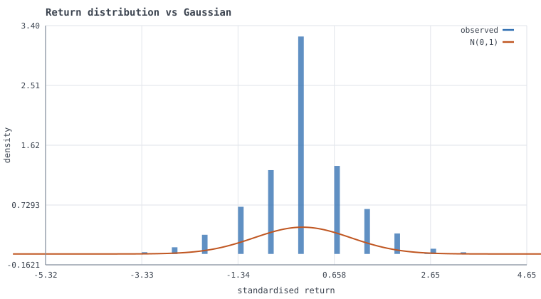

# QuantOS

A quantitative research platform: a limit order book, an agent-based market that
discovers its own price, microstructure estimators validated against ground
truth, and the statistical machinery for not fooling yourself about a backtest.

**One runtime dependency: NumPy.** Every special function, distribution,
statistical test, optimiser and root finder is implemented in `quantos.core` and
validated against SciPy — which appears *only* as a test-time oracle. The reason
is in [`docs/ddr/DDR-002`](docs/ddr/DDR-002-numpy-only-runtime.md); the
consequence is that you can read the numerics rather than take them on faith.

```bash
pip install -e ".[test]"
quantos demo                    # tour every subsystem, ~2 minutes
quantos doctor                  # environment + import check
pytest                          # 430 tests, including every docstring example
```



*Emergent return distribution from the agent-based market (excess kurtosis 1.15),
against the Gaussian its component agents were built from. Generated by
`quantos simulate --output docs/figures` — the chart renderer is 220 lines of
dependency-free SVG.*

---

## What this is, concretely

Five things that most quant repositories do not do, each linked to the code:

**1. The market simulation is measured across seeds, and reports a negative result.**
[`quantos/sim`](src/quantos/sim) runs noise traders, informed traders,
Avellaneda-Stoikov market makers, momentum and mean-reversion traders against a
real matching engine with per-agent latency. A latent fundamental value
([`fundamental.py`](src/quantos/sim/fundamental.py)) is visible to informed
traders and to nobody else.

Does the market discover it? Over 16 seeds
([`scripts/measure_price_discovery.py`](scripts/measure_price_discovery.py)) the
correlation between the mid and that latent value averages **0.29 with a standard
deviation of 0.48**, ranging from −0.69 to +0.88. So: better than chance, but
**this model does not reliably discover its own fundamental**, and any single run
is nearly uninformative. An earlier draft of this README quoted 0.78 — which was
the best of the three seeds that had been run at the time. Catching that is the
single most useful thing the measurement script did.

What *does* survive averaging is an ablation. Giving the market makers
Glosten-Milgrom inference — revise fair value up when repeatedly lifted on the
ask — triples the mean correlation, 0.09 → 0.29, and lifts the share of runs
above 0.5 from 7% to 40%. It also costs something: fair-value dispersion widens
the mean spread from 2.79 to 4.69 ticks and introduces −0.17 lag-1 return
autocorrelation. Both columns are tabulated in
[`scenarios.py`](src/quantos/sim/scenarios.py); neither dominates.

Why discovery is weak is a modelling fact worth stating: informed traders' *net*
flow is bounded by their position limits, while sign-balanced noise flow
accumulates a random walk of comparable size over the same horizon. A continuous
double auction of heuristic agents has no equilibrium mechanism forcing price to
value. Getting one requires a Kyle-style batch auction with a maker solving an
explicit filtering problem — a different model, not a tuning change.

**2. Stylised facts are measured, not asserted — and several fail.**
[`stylized_facts.py`](src/quantos/sim/stylized_facts.py) tests the simulated tape
against Cont's list. Reliably reproduced on every seed: excess kurtosis (6.8),
volatility clustering (mean ACF of |r| = 0.28) and long-memory volatility (Hurst
0.90) — none of which is present in the latent process, whose increments are
i.i.d. by construction and asserted to be so. Not reproduced: the empirical
power-law tail index (~18 against ~3), the leverage effect, and — once maker
learning is enabled — uncorrelated returns. Each failure is named in
[`scenarios.py`](src/quantos/sim/scenarios.py) along with the missing mechanism.
A simulator claiming seven of seven deserves more suspicion than one that says
which it misses and why.

**3. Microstructure estimators are validated against known answers.**
Because the simulator knows the true aggressor side of every trade and the true
size of every parent order, [`microstructure.py`](src/quantos/research/features/microstructure.py)
can score the estimators rather than merely apply them. Kyle's lambda recovers
0.002003 from a true 0.002; Roll's implied spread recovers 0.0996 from a true
0.10; Lee-Ready trade-sign inference can be given an *error rate* instead of an
assumption. That inversion — estimator as object of study — is the main reason to
build a simulator rather than download a dataset.

**4. Backtest overfitting is treated as the default hypothesis.**
[`validation.py`](src/quantos/strategy/validation.py) implements the deflated
Sharpe ratio, the probability of backtest overfitting via CSCV, purged K-fold
with an embargo, and combinatorial purged CV. `quantos validate` plants exactly
one genuinely profitable strategy among 500 and shows what each method concludes.

With a modest 6bp/day edge the search finds **pure noise** — a configuration with
a 1.51 annualised Sharpe and no edge whatsoever, which beat the real one in
sample. The naive p-value calls it significant at 0.0003. Deflation, PBO, White's
Reality Check, Hansen's SPA and StepM all decline. Raise the edge
(`--edge 0.0025`) and every method identifies the right configuration by index.
Seeing both regimes is the point: the tools are not a formality that a good
strategy passes, they are the difference between the two outcomes.

**5. Numerical edge cases are handled, and the handling is the interesting part.**
`implied_volatility` refuses to return a number when an option's time value falls
below float64 resolution next to its intrinsic value, because there is no
identifiable volatility to return — an unguarded solver happily reports `0.0` for
a case whose true volatility is 15%. `erfc`'s branch points are chosen by
*cancellation* analysis rather than convergence rate. `risk_parity` uses a damped
iteration because the textbook fixed point oscillates.

---

## Repository map

Read in this order if you want the argument rather than the API.

| Path | What lives there |
|---|---|
| [`core/special.py`](src/quantos/core/special.py) | `erf`, `ndtri`, incomplete gamma/beta from first principles. Accuracy table with measured worst cases. |
| [`core/rng.py`](src/quantos/core/rng.py) | Reproducibility contract: streams keyed by *semantic path*, so adding an agent cannot perturb another's numbers. |
| [`core/types.py`](src/quantos/core/types.py) | Integer tick prices, integer nanosecond timestamps, frozen market-data types — and why each of those is not negotiable. |
| [`exchange/book.py`](src/quantos/exchange/book.py) | Price-time priority LOB. Intrusive linked lists for O(1) cancel; lazy-deleted price heaps. Five invariants, property-tested. |
| [`exchange/matching.py`](src/quantos/exchange/matching.py) | Order lifecycle, maker/taker fees, self-trade prevention, asynchronous maker fills. |
| [`sim/`](src/quantos/sim) | Discrete-event clock, agent framework, latency model, calibrated scenarios, stylised-fact battery. |
| [`research/features/microstructure.py`](src/quantos/research/features/microstructure.py) | OFI, VPIN, Kyle's lambda, effective/realised spread decomposition, Lee-Ready with a measured error rate. |
| [`strategy/validation.py`](src/quantos/strategy/validation.py) | Deflated Sharpe, PBO, purged and combinatorial CV, walk-forward. |
| [`core/stats/multipletest.py`](src/quantos/core/stats/multipletest.py) | White's Reality Check, Hansen's SPA, Romano-Wolf StepM. |
| [`core/timeseries/`](src/quantos/core/timeseries) | OLS with HAC errors, GARCH/GJR-GARCH MLE, exact OU estimation, Engle-Granger and Johansen cointegration. |
| [`derivatives/black_scholes.py`](src/quantos/derivatives/black_scholes.py) | Full Greek set (through vanna/volga/charm), safeguarded implied volatility. |
| [`risk/`](src/quantos/risk) | Coherent risk measures, Ledoit-Wolf shrinkage, HRP, risk parity, Kelly. |
| [`execution/almgren_chriss.py`](src/quantos/execution/almgren_chriss.py) | Optimal execution frontier, square-root impact law and a test of its exponent. |
| [`probability/problems.py`](src/quantos/probability/problems.py) | Ten classic problems, each solved analytically *and* by simulation, required to agree. |
| [`docs/ers/`](docs/ers) · [`docs/ddr/`](docs/ddr) | Engineering specs and Design Decision Records — every significant choice, with its alternatives. |

---

## Things worth looking at

### The probability lab cross-checks itself

Every problem carries a closed-form solution *and* a Monte Carlo estimator
written from the problem statement, not from the formula. The test suite requires
agreement within the Monte Carlo confidence interval.

```
$ quantos probability
[OK  ] gamblers_ruin          analytic=    0.335864  MC=    0.335740 +/- 0.001056 (z=-0.12)
[OK  ] secretary_problem      analytic=    0.371043  MC=    0.368450 +/- 0.003411 (z=-0.76)
[OK  ] brownian_maximum       analytic=    0.317311  MC=    0.316630 +/- 0.001040 (z=-0.65)
[OK  ] optimal_card_stopping  analytic=    0.500000  MC=    0.497850 +/- 0.003536 (z=-0.61)
...
10/10 agree
```

An analytic derivation can be wrong in a way that looks entirely plausible. An
independent simulation is evidence; re-reading the algebra is not. The Brownian
maximum case includes a Brownian-bridge crossing correction, because naive
discrete monitoring is biased *downward* and would agree with a wrong formula.

The gambler's ruin parameters are chosen to make a point that transfers directly
to position sizing: with a 51% edge, 10 units of capital and a 100-unit target,
you win **33.6%** of the time. A positive edge does not survive a bankroll too
small for the variance.

### The order book's data structure is a decision, not an accident

95%+ of real orders are cancelled rather than filled, so middle-of-queue removal
is the *dominant* operation. `collections.deque` gives O(1) at the ends and O(n)
in the middle. An intrusive doubly-linked list plus an id→node map makes cancel
strictly O(1), which is why the benchmark sustains six figures of operations per
second in pure Python.

```bash
quantos book --operations 500000    # throughput + check_invariants()
python benchmarks/run_benchmarks.py # full suite, with environment metadata
```

Measured on an M-series Mac, CPython 3.12 (`benchmarks/run_benchmarks.py` records
the environment alongside every number):

| benchmark | rate |
|---|---|
| cancel from a random queue position | 1,356,000 /s |
| mixed add/cancel/amend | 304,000 /s |
| market orders through the matching engine | 183,000 /s |
| Black-Scholes, vectorised | 1,608,000 /s |
| implied volatility, scalar safeguarded Newton | ~19,000 /s |

Five invariants are asserted after *every* operation in randomised Hypothesis
sequences: the book is never crossed, cached level quantities match the linked
lists, the order index is complete, queue links are intact in both directions,
and total quantity is conserved.

### Backtest overfitting, demonstrated end to end

```bash
quantos validate --configurations 500
```

Plants exactly one genuinely profitable strategy among 500, then shows the naive
Sharpe ratio calling the winner significant, the deflated Sharpe ratio correctly
declining to, and Romano-Wolf StepM recovering the planted strategy by index.

### Portfolio construction where N/T is realistic

```bash
quantos portfolio --assets 80 --train 150
```

Reports the sample covariance's condition number, the Ledoit-Wolf shrinkage
intensity chosen analytically, the Marchenko-Pastur noise band, and the
out-of-sample volatility of five methods. The gap between in-sample and
out-of-sample volatility for the unshrunk minimum-variance portfolio is the
error-maximisation problem in one number.

---

## Verification

The test suite is not only unit tests. Four kinds of check, because different
kinds of error hide from different kinds of test:

1. **Independent oracles.** `quantos.core.special` is compared against both
   SciPy and CPython's `math` module. Median relative error is at machine epsilon
   for every function; worst cases are tabulated in the module docstring. In the
   far tail QuantOS is *more* accurate than the oracle — `erfc(26.68)` underflows
   to `0.0` in SciPy while the continued fraction returns the correct
   `1.46e-311`, so the comparison excludes subnormal results rather than
   pretending the oracle is right there.
2. **Analytic ↔ Monte Carlo agreement.** The whole probability lab, plus the OU
   first-passage time (analytic 0.3563 against a simulated 0.3654).
3. **Property-based invariants.** Hypothesis drives random operation sequences at
   the order book and asserts structural invariants after each one.
4. **Recovery of known parameters from synthetic data.** GARCH recovers
   α=0.075/β=0.906 from a true 0.08/0.90; GJR recovers the leverage term
   γ=0.124 from 0.12; OU recovers θ=3.91 from 4.0; Johansen recovers the exact
   cointegrating vector and holds a 2.7% false-positive rate against a nominal
   5%; every Black-Scholes Greek matches a central difference to ≤6.3e-9.

Every worked example in every docstring is executed by `pytest --doctest-modules`.
Several wrong values were caught exactly that way during development.

**430 tests, 83.8% line coverage, ruff and mypy clean.** CI runs the suite on
Python 3.10–3.13 across Linux, macOS and Windows, plus three jobs that check
properties the unit tests cannot: that a runtime-only install has no SciPy and
still imports every module (enforcing DDR-002), that the same seed produces
byte-identical simulation output, and that the benchmarks run.

### Critical values are simulated, not remembered

Johansen's trace statistic initially showed a **28% false-positive rate against a
nominal 5%**, because a published critical-value table assumed a different
treatment of the VECM constant. Rather than hunt for the right table,
[`scripts/tabulate_johansen.py`](scripts/tabulate_johansen.py) simulates the null
distribution *of the statistic this code computes*. The resulting `k−r=1` value
of 8.39 sits next to the 8.18 published for the unrestricted-constant case, which
identifies the specification and confirms the original table was the wrong one.
Empirical size is now 2.7%.

---

## Honest limitations

- **Python, not C++.** The order book is fast for pure Python and slow for a real
  venue. The APIs are shaped so a Rust or C++ core could slot in behind them, but
  that has not been done.
- **No real market data.** Everything is simulated or synthetic. This is
  deliberate — ground truth is the whole point — but it means no claim here is
  evidence about actual markets.
- **The simulation is calibrated, and says so.** Realistic behaviour occupies a
  narrow region of a large parameter space. `scenarios.py` records what each
  configuration was tuned for and what went wrong before it was.
- **Price discovery is weak.** Mean correlation with the latent fundamental is
  0.29 with a standard deviation of 0.48 across seeds. The market is not
  efficient in any strong sense, and the README says so rather than quoting the
  best run. See point 1 above for the mechanism.
- **PBO is noisy.** Measured across 12 independent skill-less datasets it centres
  correctly on 0.449 but individual values range from 0.10 to 0.70. A single PBO
  number should not be quoted as a verdict; the docstring says so.
- **No live trading, no broker integration, and no strategy that makes money.**
  This is research infrastructure.

## Documentation

- [`docs/ers/`](docs/ers) — Engineering Requirement Specifications per subsystem.
- [`docs/ddr/`](docs/ddr) — Design Decision Records: the choice, the alternatives
  considered, the trade-off accepted, and what would change the decision.
- [`docs/MATH.md`](docs/MATH.md) — derivations for the non-obvious formulas.

## License

MIT. See [LICENSE](LICENSE).
