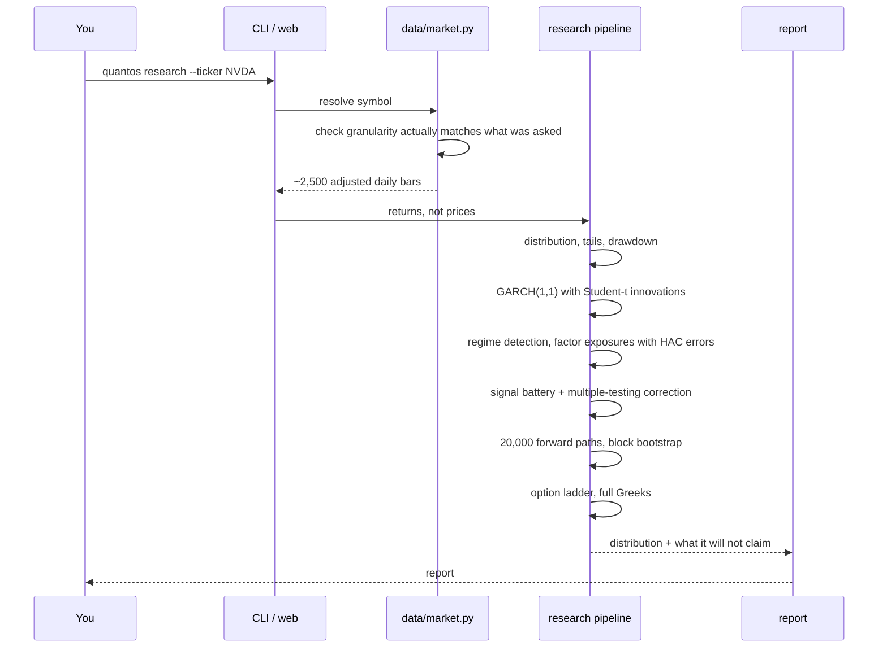

# Architecture

QuantOS is one Python package with one runtime dependency. Everything below is
implemented inside this repository — the special functions, the distributions,
the optimisers, the charts and the data feed included. The reasoning for that
constraint is in [DDR-002](ddr/DDR-002-numpy-only-runtime.md); the short version
is that a research tool whose numbers you cannot trace is not a research tool.

## The shape of it

```mermaid
graph TD
    subgraph entry ["Entry points"]
        CLI["quantos CLI<br/>15 subcommands"]
        WEB["Web app<br/>search bar + PWA"]
        LIB["Python API<br/>import quantos"]
    end

    subgraph data ["Data — no API key"]
        FEED["data/market.py<br/>daily bars, split &amp; dividend adjusted"]
        FRED["data/fred.py<br/>macro series"]
        FACT["data/factors.py<br/>Fama-French, aligned onto the instrument grid"]
    end

    subgraph core ["Numerical core — written here, not imported"]
        SPEC["core/special.py<br/>erf · ndtri · incomplete gamma/beta"]
        RNG["core/rng.py<br/>streams keyed by semantic path"]
        TS["core/timeseries/<br/>OLS+HAC · GARCH MLE · OU · cointegration"]
        MT["core/stats/multipletest.py<br/>Reality Check · SPA · StepM"]
    end

    subgraph research ["Research"]
        FC["forecast/<br/>GARCH paths · probabilities · calibration"]
        MODELS["models/<br/>baselines, leaderboard"]
        MICRO["research/features/<br/>OFI · VPIN · Kyle's lambda"]
        SVI["research/vol_surface.py<br/>SVI, arbitrage conditions"]
        VAL["strategy/validation.py<br/>deflated Sharpe · PBO · purged CV"]
    end

    subgraph pricing ["Derivatives &amp; risk"]
        BS["derivatives/black_scholes.py<br/>full Greek set"]
        AM["derivatives/american.py<br/>LSMC + dual upper bound"]
        LAT["derivatives/lattice.py<br/>CRR binomial · Boyle trinomial"]
        HES["derivatives/heston.py<br/>Fourier inversion"]
        MM["derivatives/market_making.py"]
        RISK["risk/<br/>VaR backtest · EVT · HRP · Kelly"]
        EXEC["execution/<br/>Almgren-Chriss + impact calibration"]
    end

    subgraph sim ["Simulation"]
        BOOK["exchange/book.py<br/>price-time priority LOB"]
        AGENTS["sim/<br/>discrete-event clock, agents, latency"]
    end

    subgraph honesty ["Held to account by CI"]
        LEDGER["live/ledger.py<br/>hash-chained forward record"]
        CLAIMS["scripts/verify_claims.py<br/>23 documented claims re-derived"]
        MUT["scripts/mutation_test.py<br/>are the tests load-bearing?"]
    end

    CLI --> FEED
    WEB --> FEED
    LIB --> FEED
    FEED --> FC
    FRED --> FC
    FACT --> VAL
    SPEC --> FC
    SPEC --> BS
    SPEC --> RISK
    RNG --> FC
    RNG --> AGENTS
    TS --> FC
    MT --> VAL
    FC --> MODELS
    FC --> LEDGER
    BS --> AM
    BS --> SVI
    BS --> MM
    HES --> AM
    BS --> LAT
    LAT --> AM
    BOOK --> AGENTS
    MICRO --> VAL

    CLAIMS -.verifies.-> FC
    CLAIMS -.verifies.-> RISK
    CLAIMS -.verifies.-> BS
    MUT -.grades tests of.-> FC
    MUT -.grades tests of.-> RISK
```

## The three layers that matter

**A numerical core with no dependencies.** `core/special.py` implements `erf`,
`ndtri`, and the incomplete gamma and beta functions from published rational
approximations and continued fractions. Every statistical test above it — every
p-value, every confidence interval — bottoms out there. Its accuracy table is
measured against SciPy in CI, and SciPy is installed *only* in the test job. A
separate CI job installs the package without it and runs the full pipeline, so
the constraint cannot rot.

**A research layer that reports what it cannot do.** The forecast module returns
a distribution, not a line, because over a 160-day horizon the expected return
cannot be estimated to useful precision and drawing a median path that slopes
upward would be a lie about the evidence. Every signal in the battery is judged
after a multiple-testing correction. The model leaderboard has an attention
model on it that *loses* to GARCH, and CI fails if it ever starts winning without
the leaderboard being updated to say so.

**An accountability layer.** Three mechanisms, all in CI:

| Mechanism | What it prevents |
|---|---|
| [`live/ledger.py`](../src/quantos/live/ledger.py) | Predictions are appended to a hash-chained record before the outcome is known, so a forecast cannot be quietly revised after the fact. Overlapping horizons are discounted by greedy interval scheduling rather than double-counted. |
| [`scripts/verify_claims.py`](../scripts/verify_claims.py) | Documentation rots silently — a refactor moves a constant and the prose keeps quoting the old figure. Twenty-three documented claims are re-derived on every push. |
| [`scripts/mutation_test.py`](../scripts/mutation_test.py) | Coverage says a line ran, not that anything checked it. Mutating the source and requiring a test to fail is the difference. It found a module at **0%** — no test file existed at all. |

## Data flow for a single ticker

The step worth pointing at is the granularity check. Asking a public endpoint for
`range=max` will happily return *monthly* bars while the request said daily; the
feed compares what came back against `dataGranularity` and refuses a mismatch
rather than silently computing annualised volatility from the wrong bar size.

## Repository layout

| Path | What lives there |
|---|---|
| [`core/`](../src/quantos/core) | Special functions, RNG contract, integer tick/nanosecond types, time series, multiple-testing |
| [`data/`](../src/quantos/data) | Market bars, FRED macro, Fama-French factors, intraday CSV |
| [`exchange/`](../src/quantos/exchange) | Limit order book, matching engine, optional C++ backend |
| [`sim/`](../src/quantos/sim) | Discrete-event simulation, agents, latency, stylised-fact battery |
| [`forecast/`](../src/quantos/forecast) | Path simulation, probability estimates, calibration |
| [`derivatives/`](../src/quantos/derivatives) | Black-Scholes, American LSMC, Heston, market making |
| [`risk/`](../src/quantos/risk) | VaR backtesting, EVT, coherent measures, HRP, Kelly |
| [`execution/`](../src/quantos/execution) | Almgren-Chriss, impact calibration, schedule comparison |
| [`strategy/`](../src/quantos/strategy) | Validation: deflated Sharpe, PBO, purged and combinatorial CV |
| [`planning/`](../src/quantos/planning) | Investment projection, and the distribution the projection hides |
| [`research/`](../src/quantos/research) | Microstructure features, SVI surface, intraday volatility |
| [`live/`](../src/quantos/live) | The forward-testing ledger |
| [`web/`](../src/quantos/web) | Server and report rendering |
| [`viz/`](../src/quantos/viz) | SVG charts, written here — no plotting library |
