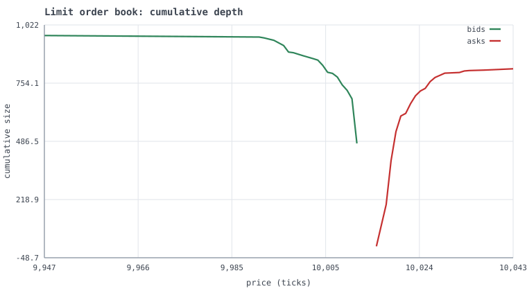
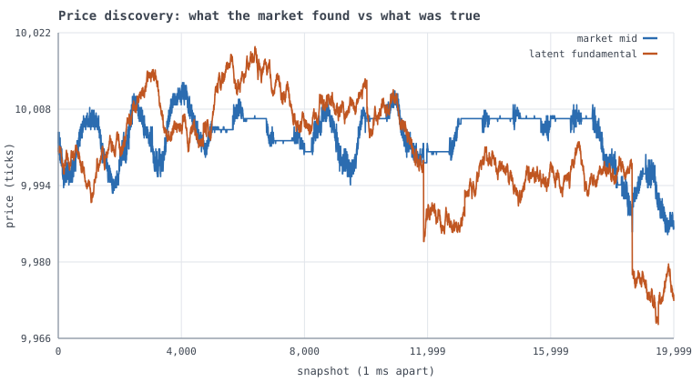
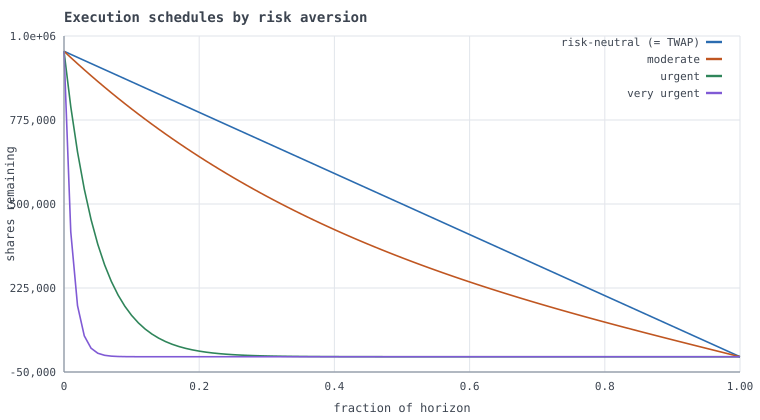
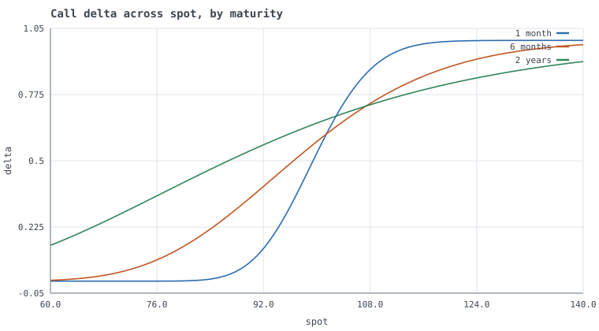
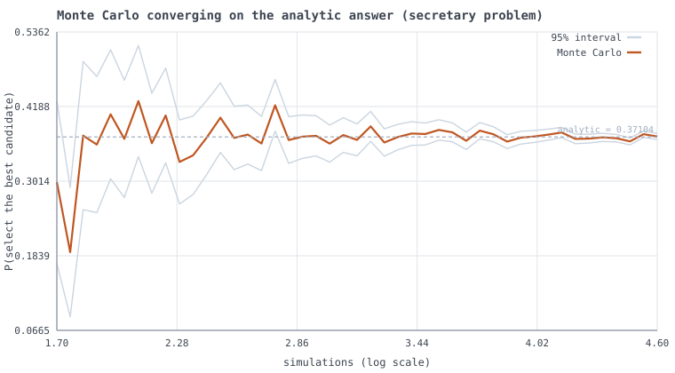
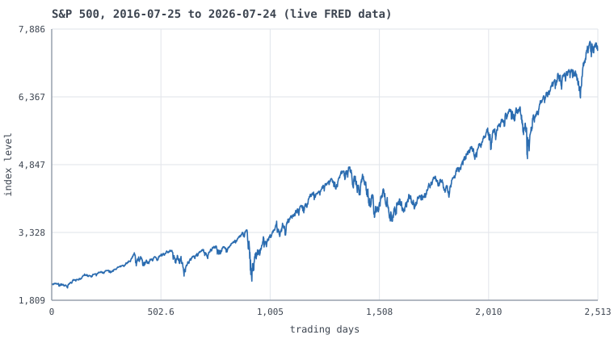

# Gallery

Every figure below is generated by `python scripts/build_gallery.py` from a
real computation -- no mock-ups. All are rendered by
[`quantos/viz/svg.py`](../src/quantos/viz/svg.py), a 480-line
dependency-free SVG writer, because a chart library would have broken the
NumPy-only runtime rule in [DDR-002](ddr/DDR-002-numpy-only-runtime.md).

---

## Order book depth



Cumulative resting size on each side of a simulated book, after six seconds of trading between 26 agents. The cumulative curve *is* the cost function of a marketable order: read off how far a sweep of a given size would walk the book.

---

## Price discovery



The dashed line is a fundamental value visible only to informed traders. The market has to infer it from order flow. This is a *favourable* seed: measured across 16 seeds the correlation averages 0.29 with a standard deviation of 0.48, and the README says so rather than showing only this one.

---

## Emergent fat tails


Returns from the simulated market against the Gaussian its component agents were built from. No agent was told to produce fat tails; they emerge from order-book mechanics and inventory-averse liquidity provision.

---

## Optimal execution frontier


There is no single optimal way to work a large order -- only a frontier, with risk aversion picking a point on it. The bottom-right end is TWAP, which is not a naive baseline but the exact optimum for a trader indifferent to price risk.

---

## Execution schedules



The same one-million-share order, worked four ways. Risk-neutral gives a straight line; increasing urgency front-loads toward an exponential decay. Permanent impact is identical in all four -- you cannot schedule your way out of it.

---

## Implied volatility inversion


A skewed volatility surface priced with Black-Scholes, then inverted back out of the prices. The two curves coincide to twelve decimal places, including deep out-of-the-money strikes where vega is ~1e-9 and naive Newton iteration diverges.

---

## Option Greeks



Call delta against spot for three maturities. As expiry approaches the curve steepens toward a step function at the strike -- which is why gamma explodes and hedging a short-dated option near the money is hard. All ten Greeks are analytic and match central differences to 6e-9.

---

## Deflated Sharpe ratio


One unchanged five-year track record with a 2.4 annualised Sharpe. The x-axis is how many strategy configurations you tried before finding it. The evidence does not change; what it is worth does. This is the single most under-reported number in quantitative research.

---

## Portfolio construction under estimation error


Forty assets, shrinking the training window from 800 observations to 60. Minimum-variance on the raw sample covariance degrades sharply as N/T rises, because it inverts the matrix and so loads on its noisiest directions. Shrinkage and HRP hold up; HRP never inverts anything.

---

## Analytic answers, checked by simulation



Every problem in the Probability Lab is solved twice: once in closed form, once by a simulation written from the problem statement without reference to the formula. Agreement within the Monte Carlo interval is the test. All ten agree.

---

## Real market data



The S&P 500 from 2016-07-25 to 2026-07-24, pulled live from FRED with no API key and no dependency beyond the standard library. `quantos analyse --bundle equity` produces the full statistical report.

---

## Real returns are not Gaussian


The same data as a distribution. The Gaussian overlay is what a risk model assuming normality believes; the histogram is what happened. The gap in the tails is why VaR computed parametrically understates losses, and why CVaR is the coherent measure.

---

## Reproducing these

```bash
pip install -e '.[test]'
python scripts/build_gallery.py
```

The real-data panels pull live series from FRED and cache them under
`~/.cache/quantos`, so re-running updates them. Pass `--offline` to use
only what is already cached.
